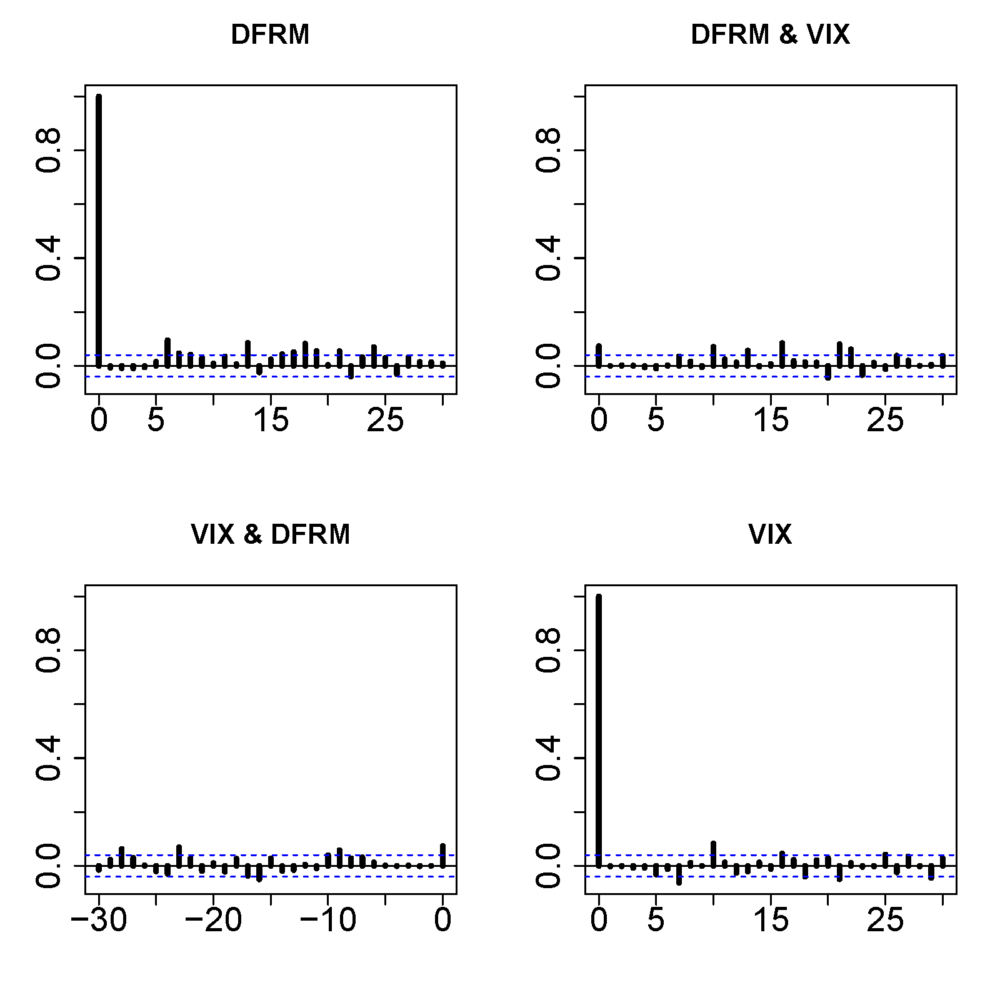
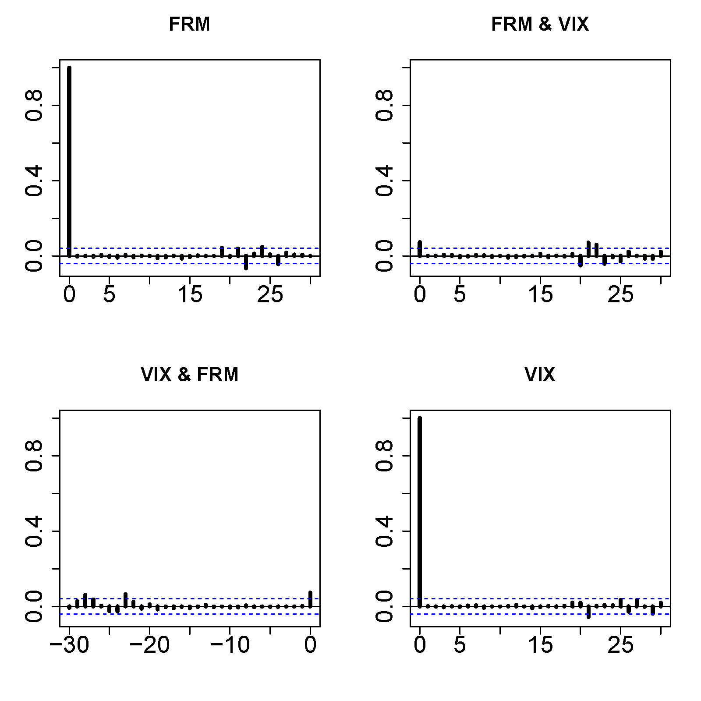

[](http://quantlet.de/)

## [](http://quantlet.de/) **FRM_VIX** [](http://quantlet.de/)

```yaml

Name of Quantlet : FRM_VIX

Published in : 'FRM: A Financial Risk Meter based on penalizing tail events occurrence'

Description : 'compare the FRM and VIX by using correlation analysis and causality analysis, plot
the FRM and VIX series, plot the autocorrelation function of residuals'

Keywords : plot, acf, causality, correlation, residuals, risk, penalty, tail

See also : FRM_SRISK, FRM_GT

Author : Lining Yu

Submitted : THU, December 15 2016 by Lining Yu

Datafile : FRM_VIX_SRISK_GT.csv

```






### R Code:
```r
rm(list = ls())
graphics.off()
# set the working directory setwd('C:/...')

libraries = c("vars", "stats", "tseries", "quantmod", "tsDyn", "dygraphs", "urca", 
    "xtable")
lapply(libraries, function(x) if (!(x %in% installed.packages())) {
    install.packages(x)
})
lapply(libraries, library, quietly = TRUE, character.only = TRUE)
data = read.csv("FRM_VIX_SRISK_GT.csv")
dt = as.Date(data[, 1], format = "%d/%m/%Y")
FRM = as.matrix(data[, 2])
adf.test(FRM)
VIX = as.matrix(data[, 3])
adf.test(VIX)

########### scale variables #################
VIX = (VIX - min(VIX))/(max(VIX) - min(VIX))
FRM = (FRM - min(FRM))/(max(FRM) - min(FRM))

########### plot FRM and VIX ################
plot(dt, FRM, ylab = "", xlab = "", pch = 16, col = "white", , cex.axis = 2, font.axis = 2, 
    type = "l")
lines(dt, FRM, col = "black", lwd = 8)
lines(dt, VIX, col = "red", lwd = 3)

########## Correlation analysis #############
cor(FRM, VIX, method = "pearson")
cor.test(FRM, VIX, method = "pearson")

####### Causality FRM and VIX ###############
VAR = cbind(FRM, VIX)
colnames(VAR) = c("FRM", "VIX")
VARselect(VAR, lag.max = 20, type = "both")
varest1 = VAR(VAR, p = 3, type = "both")
resid = residuals(varest1)
serial.test(varest1, lags.pt = 20, type = "PT.asymptotic")
serial.test(varest1, lags.pt = 20, type = "PT.adjusted")
serial.test(varest1, lags.pt = 20, type = "BG")
serial.test(varest1, lags.pt = 20, type = "ES")
causality(varest1, cause = "FRM")$Granger
causality(varest1, cause = "VIX")$Granger
acf(resid, ylab = "", cex.axis = 2, lwd = 4, xlab = "", cex.main = 1.6)[1]

####### Causality DFRM and VIX ###############
adf.test(diff((FRM)))
VAR = cbind(diff((FRM)), VIX[-1])
colnames(VAR) = c("DFRM", "VIX")
VARselect(VAR, lag.max = 20, type = "both")
varest1 = VAR(VAR, p = 19, type = "both")
resid = residuals(varest1)
serial.test(varest1, lags.pt = 20, type = "PT.asymptotic")
serial.test(varest1, lags.pt = 20, type = "PT.adjusted")
serial.test(varest1, lags.pt = 20, type = "BG")
serial.test(varest1, lags.pt = 20, type = "ES")
causality(varest1, cause = "DFRM")$Granger
causality(varest1, cause = "VIX")$Granger
acf(resid, ylab = "", cex.axis = 2, lwd = 4, xlab = "", cex.main = 1.6)[1]


```
